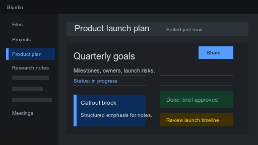

# Bluefin

Bluefin is a clean, document-focused Obsidian theme with light and dark modes, compact navigation, readable editor typography, and a work-oriented interface.

## Features

- Light and dark color schemes
- Document-style editor layout
- Compact sidebars, tabs, and navigation states
- Styled callouts, tables, tags, inputs, menus, and code blocks
- Local-only CSS with no remote fonts, scripts, telemetry, or network assets

## Markdown Showcase

Use [docs/markdown-showcase.md](docs/markdown-showcase.md) as a visual regression document when checking Bluefin in Obsidian. It covers headings, links, lists, tables, blockquotes, callouts, code blocks, math, embeds, HTML, comments, block references, and tasks.

## Installation

1. Download the latest release from GitHub.
2. Extract the theme folder into your vault at `.obsidian/themes/Bluefin`.
3. In Obsidian, open **Settings -> Appearance -> Themes**.
4. Select **Bluefin**.

## Community Theme Submission

For the Obsidian community theme directory, this repository is intended to be published from the theme folder itself. The repository root should contain:

- `manifest.json`
- `theme.css`
- `README.md`
- `LICENSE`
- `screenshot.png`

## License

MIT
