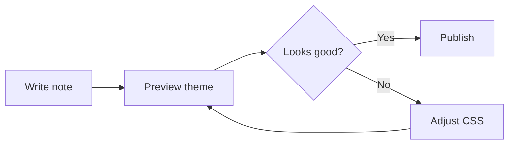

# Bluefin Markdown Showcase

This document is a visual test page for Markdown and Obsidian-specific syntax. Copy it into an Obsidian vault using Bluefin to review typography, spacing, colors, and interaction states.

## Inline Formatting

Plain text should be easy to read. This sentence includes **bold text**, *italic text*, ***bold italic text***, ~~strikethrough text~~, ==highlighted text==, `inline code`, #inline-tag, and a footnote reference.[^intro]

Use links to test colors and hover states: [Obsidian website](https://obsidian.md), [[Example Document]], [[A Missing Internal Page]], and an alias link [[Example Document|aliased internal link]].

[^intro]: This is a footnote. It should be readable without overpowering the page.

## Code Block Showcase

```python
from dataclasses import dataclass


@dataclass
class ThemeCheck:
    name: str
    supports_dark_mode: bool
    supports_light_mode: bool


bluefin = ThemeCheck(
    name="Bluefin",
    supports_dark_mode=True,
    supports_light_mode=True,
)

print(f"{bluefin.name} is ready for visual testing.")
```

## Headings

# Heading 1 Sample

## Heading 2 Sample

### Heading 3 Sample

#### Heading 4 Sample

##### Heading 5 Sample

###### Heading 6 Sample

## Paragraphs

Short paragraphs should feel crisp and document-like.

Longer paragraphs should preserve comfortable reading rhythm across multiple lines. The theme should maintain enough contrast for extended reading while keeping the workspace calm. This paragraph is intentionally longer to test line height, readable width, and wrapping behavior in both Reading view and Live Preview.

## Blockquotes

> A simple blockquote should stand apart from the surrounding text without becoming too visually heavy.

> This is a multi-line blockquote with enough text to wrap across more than one visual row in the editor. The left border should remain a single continuous vertical guide instead of restarting or shifting inward on each row.
>
> The second paragraph should align with the first paragraph and preserve the same left border position.

> A nested quote can include multiple lines.
>
> > Nested content should still be legible and maintain clear indentation.

## Lists

- Unordered item
- Unordered item with **bold emphasis**
  - Nested unordered item
  - Nested unordered item with `inline code`
- Final unordered item

1. Ordered item
2. Ordered item with a link to [[Example Reference Note]]
3. Ordered item with nested steps
   1. Nested ordered item
   2. Nested ordered item

- [ ] Open task
- [x] Completed task
- [ ] Task with a due date placeholder: 2026-05-19
- [ ] Task with #task-tag and [[Example Document]]

## Table

| Area | Owner | Status | Notes |
| --- | --- | --- | --- |
| Navigation | Design | In progress | Check active file states |
| Editor | Writing | Done | Verify line length and headings |
| Code | Engineering | Review | Test syntax highlighting |
| Mobile | QA | Planned | Check touch target spacing |

## Horizontal Rule

Above the rule.

---

Below the rule.

## Callouts

> [!note]
> A note callout should be calm, readable, and visually distinct.

> [!info] Info With Title
> Informational callouts should use the theme accent without becoming too bright.

> [!tip]
> Tips should feel helpful and lightweight.

> [!success] Success
> Success callouts test positive state color.

> [!warning] Warning
> Warning callouts test warm color contrast.

> [!danger] Danger
> Danger callouts test error color contrast.

> [!quote]
> Quote callouts should still look like part of the document system.

## Code

Inline command: `npm run build`

```bash
#!/usr/bin/env bash
set -euo pipefail

theme_name="Bluefin"
echo "Testing ${theme_name}"
```

```js
const theme = {
  name: "Bluefin",
  modes: ["dark", "light"],
  publishReady: true,
};

function describeTheme({ name, modes }) {
  return `${name} supports ${modes.join(" and ")} mode.`;
}

console.log(describeTheme(theme));
```

```ts
type ThemeMode = "dark" | "light";

interface ThemeManifest {
  name: string;
  version: `${number}.${number}.${number}`;
  modes: ThemeMode[];
}

const manifest: ThemeManifest = {
  name: "Bluefin",
  version: "1.0.0",
  modes: ["dark", "light"],
};
```

```css
.theme-light {
  --background-primary: #ffffff;
  --text-normal: #172b4d;
}

.theme-dark {
  --background-primary: #1d2125;
  --text-normal: #c7d1db;
}
```

```json
{
  "name": "Bluefin",
  "version": "1.0.0",
  "modes": ["dark", "light"]
}
```

```diff
- "author": "Unknown"
+ "author": "Theme Author"
```



## Math

Inline math should sit neatly in text: $E = mc^2$.

Block math:

$$
\int_0^1 x^2 dx = \frac{1}{3}
$$

## Images And Embeds

Image syntax with alt text:


Embedded note:

![[Example Document]]

Embedded block placeholder:

![[Example Document#^example-block]]

## HTML

<details>
<summary>Expandable details</summary>

This tests basic HTML rendering inside a Markdown note.

</details>

<kbd>Cmd</kbd> + <kbd>P</kbd>

## Comments

Visible text before a comment.

%% This Obsidian comment should be hidden in Reading view. %%

Visible text after a comment.

## Properties, Tags, And Links

Tags: #bluefin #theme-test #markdown

Related notes:

- [[Example Document]]
- [[Example Reference Note]]
- [[Example Meeting Note]]

## Block References

This paragraph can be linked as a block reference. ^bluefin-test-block

Reference it with `[[Bluefin Markdown Showcase#^bluefin-test-block]]`.

## Escaped Markdown

\*This should show literal asterisks instead of italic text.\*

\# This should not become a heading.

## Final Checklist

- [ ] Check light mode
- [ ] Check dark mode
- [ ] Check Reading view
- [ ] Check Live Preview
- [ ] Check narrow window width
- [ ] Check long code lines

